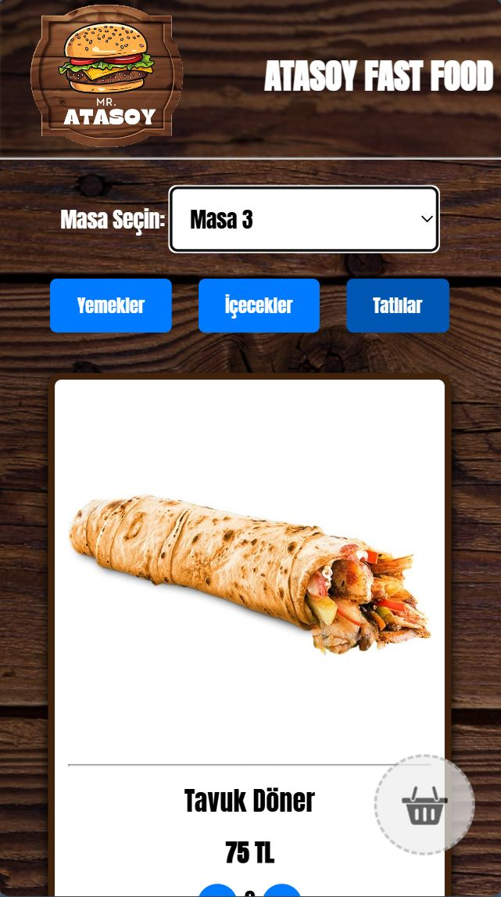

# 📱 Restoranda Uzaktan Telefonda Menüden Sipariş Verme Sistemi

### 🍽️ **Kullanıcı Dostu ve Verimli Sipariş Sistemi**

Bu projede, **restoran müşterilerinin** masalarından kalkmadan, telefonları aracılığıyla **menüden sipariş verebilecekleri** kullanıcı dostu bir sistem geliştirdim. Proje, hem **müşteri memnuniyetini artırmayı** hem de sipariş süreçlerini **daha verimli** hale getirmeyi hedefliyor. 🌟

---

## 🚀 **Özellikler**

### 📱 **Kullanıcı Dostu Arayüz**
- Mobil cihazlardan **kolayca erişilebilen**, basit ve sezgisel bir menü arayüzü.

### ⚡ **Hızlı ve Kolay Sipariş**
- Müşteriler, **QR kod** veya **link** ile menüye erişip, zahmetsizce siparişlerini verebilirler.

### ⏱️ **Gerçek Zamanlı Sipariş Takibi**
- Siparişler anında mutfağa iletilir ve **hazırlık süreci** gerçek zamanlı olarak takip edilebilir.

### 🛠️ **Yönetim Paneli**
- Restoran çalışanlarının siparişleri **kolayca yönetebileceği** ve takip edebileceği, kullanışlı bir yönetim paneli.

### 💬 **Müşteri Geri Bildirimi**
- Müşterilerin, sipariş deneyimleri hakkında **geri bildirimde bulunabileceği** entegre bir sistem.

---

## 🎥 **Proje Videosu**
[Restoranda Uzaktan Sipariş Verme Sistemini İzle](https://lnkd.in/dduDRM2r)

---

**Bu proje, restoranların dijital dönüşümüne katkı sağlıyor, müşteri deneyimini iyileştirirken operasyonel verimliliği de artırıyor!**

---

🌟 **Daha Fazlası İçin:**
GitHub'da projeyi inceleyin ve katkıda bulunun! ⭐

